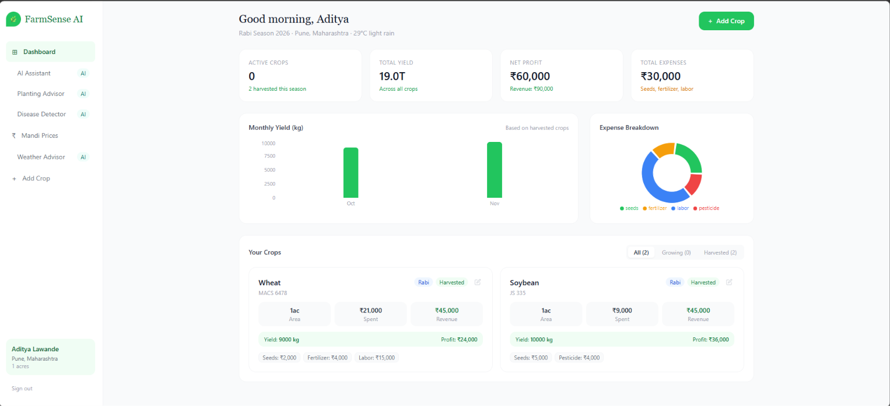
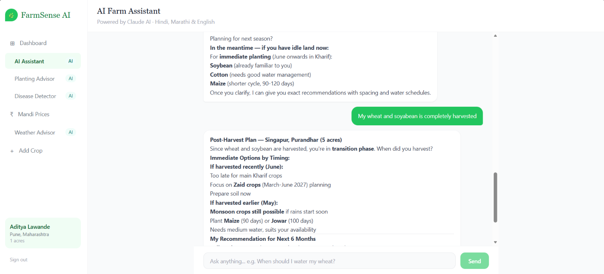
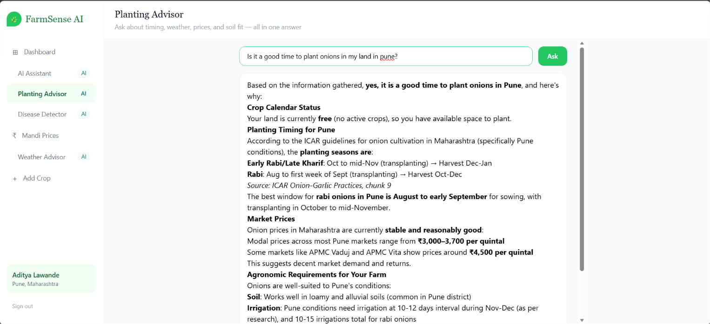
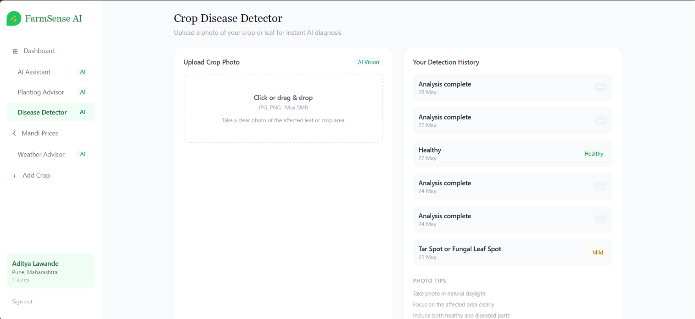
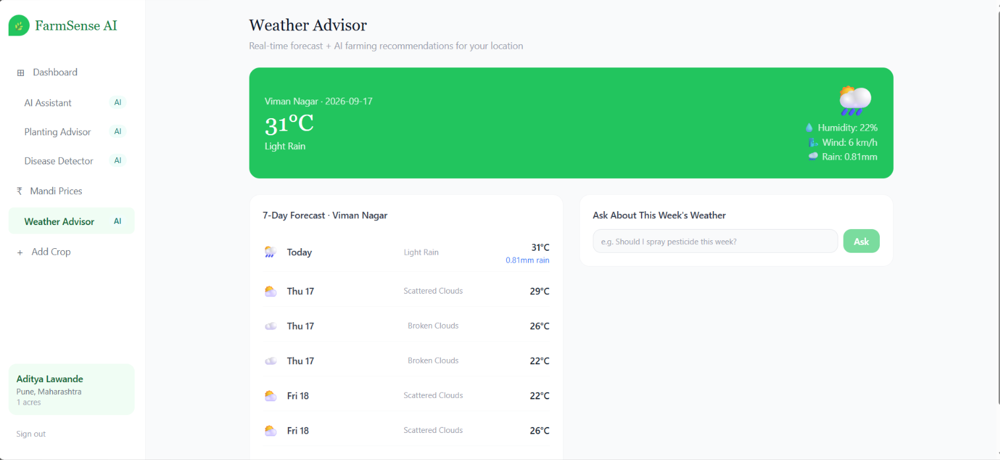
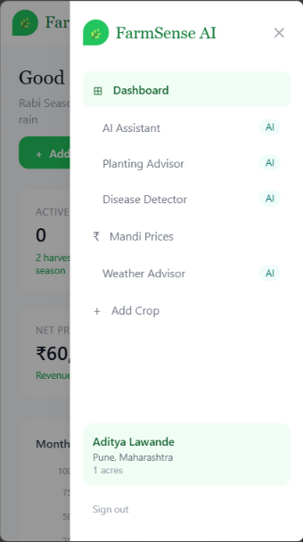
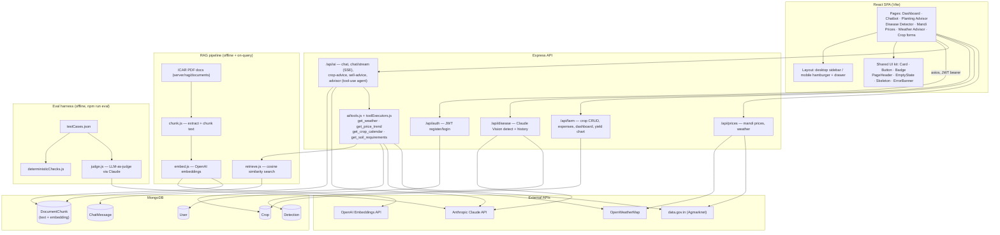

# 🌾 FarmSense AI — Smart Farming Companion

A full-stack MERN application with AI integration for Indian farmers. Built with MongoDB, Express, React, Node.js, and the Anthropic Claude API.

---

## 📸 Screenshots

|                       |                                                            |
| --------------------- | ---------------------------------------------------------- |
| **Dashboard**         |                |
| **AI Chatbot**        |                    |
| **Planting Advisor**  |           |
| **Disease Detector**  |  |
| **Mandi Prices**      |          |
| **Weather Advisor**   |    |
| **Mobile navigation** |              |

---

## ✨ Features

| Feature             | Description                                                                                                                                       | AI                                     |
| ------------------- | ------------------------------------------------------------------------------------------------------------------------------------------------- | -------------------------------------- |
| 🤖 AI Chatbot       | Streaming chat in Hindi, Marathi, or English, with saved history                                                                                  | ✅ Claude (streaming + prompt caching) |
| 🌱 Planting Advisor | Ask planting/crop questions; agent calls live tools (weather, mandi price trend, your active crops, soil/climate reference docs) before answering | ✅ Claude tool-use agent + RAG         |
| 🌿 Disease Detector | Upload a leaf/crop photo for instant diagnosis, treatment steps, and a saved detection history                                                    | ✅ Claude Vision                       |
| 📈 Mandi Prices     | Live government mandi (market) prices by crop/state + AI sell-now-or-wait advice                                                                  | ✅ Claude                              |
| 🌦 Weather Advisor  | 7-day forecast for the farmer's location + free-form Q&A grounded in that forecast                                                                | ✅ Claude                              |
| 📊 Farm Dashboard   | Crop tracking, monthly yield chart, profit/loss from logged expenses                                                                              | —                                      |
| 🌱 Crop Management  | Add/edit/delete crops, log expenses per crop, track season & growth stage                                                                         | —                                      |

---

## 🛠 Tech Stack

- **Frontend**: React 18, Vite, Tailwind CSS, React Router, Recharts, react-markdown
- **Backend**: Node.js, Express, MongoDB, Mongoose, JWT auth
- **AI**: Anthropic Claude (`claude-haiku-4-5`) — chat, SSE streaming, prompt caching, vision, and a tool-use agent loop
- **RAG**: OpenAI `text-embedding-3-small` embeddings over chunked ICAR reference PDFs, cosine-similarity retrieval, stored in MongoDB
- **Eval harness**: a small offline test-suite (`server/eval`) — deterministic checks (language, word count, no invented prices) plus an LLM-as-judge for qualitative checks, run against the real chat system prompt
- **Weather**: OpenWeatherMap API
- **Market prices**: data.gov.in Agmarknet resource
- **File upload**: Multer

---

## 🏗 Architecture



**A few notes on how the pieces fit together:**

- **Planting Advisor** is a tool-use agent loop, not a single prompt: Claude decides which of the four tools it needs (weather / price trend / the farmer's own active crops / soil requirements from the reference documents), the server executes them, and results are fed back until Claude has enough to answer — citing the source document when it used RAG.
- **RAG** is currently seeded from one ICAR onion & garlic practices PDF (`server/rag/documents/`) — chunked, embedded, and stored in `DocumentChunk`; `retrieve.js` does a cosine-similarity search over those embeddings at query time. Add more PDFs to that folder and re-run the embed step to extend the knowledge base.
- **Prompt caching + streaming**: `ai.js` splits the system prompt into a static, cached block (the persona/rules) and a per-request farmer-context block, and exposes both a normal JSON `/chat` endpoint and an SSE `/chat/stream` endpoint.
- **Eval harness** runs the same `buildSystemBlocks`/system prompt the real `/chat` route uses against a fixed set of test questions, checking things an LLM shouldn't get wrong (responds in the requested language, doesn't invent a mandi price, stays under the length rule) deterministically, and uses Claude itself as a judge for the fuzzier checks.

---

## 🚀 Getting Started

### Prerequisites

- Node.js 18+
- MongoDB (local or Atlas)
- Anthropic API key → https://console.anthropic.com
- OpenAI API key → https://platform.openai.com/api-keys (only needed if you re-embed the RAG documents)
- OpenWeatherMap API key → https://openweathermap.org/api (free tier works)
- data.gov.in API key → https://data.gov.in (free account, for live mandi prices)

---

### 1. Clone & Setup

```bash
git clone <your-repo-url>
cd ai-farmsense
```

### 2. Backend Setup

```bash
cd server
npm install

# Create .env file
cp .env.example .env
```

Fill in `server/.env` (see `.env.example` for the full list and where each key comes from):

```env
PORT=5000
MONGO_URI=mongodb://localhost:27017/ai-farmsense
JWT_SECRET=your_super_secret_key_here
CLIENT_URL=http://localhost:5173
ANTHROPIC_API_KEY=sk-ant-your-key-here
OPENAI_API_KEY=sk-your-openai-key-here
OPENWEATHER_API_KEY=your-openweather-key-here
DATA_GOV_API_KEY=your-data-gov-in-key-here
```

```bash
npm run dev
```

Server runs on http://localhost:5000

### 3. Frontend Setup

```bash
cd client
npm install
npm run dev
```

Frontend runs on http://localhost:5173

By default the client talks to `http://localhost:5000/api`. To point it elsewhere, set `VITE_API_URL` (e.g. in `client/.env`).

### 4. (Optional) Seed the RAG knowledge base

Reference PDFs live in `server/rag/documents/` (gitignored — bring your own). To (re)chunk and embed them into MongoDB:

```bash
cd server
node rag/embed.js
```

### 5. (Optional) Run the eval suite

Runs the chat system prompt against a fixed set of test questions and checks the responses:

```bash
cd server
npm run eval
```

---

## 📁 Project Structure

```
ai-farmsense/
├── client/                          # React frontend
│   ├── src/
│   │   ├── pages/
│   │   │   ├── Login.jsx            # Auth — login
│   │   │   ├── Register.jsx         # Auth — 3-step registration
│   │   │   ├── Dashboard.jsx        # Stat cards, yield chart, crop list
│   │   │   ├── Chatbot.jsx          # Streaming AI chat assistant
│   │   │   ├── Advisor.jsx          # Planting Advisor (tool-use agent + RAG)
│   │   │   ├── DiseaseDetector.jsx  # Image upload + AI diagnosis + history
│   │   │   ├── MandiPrices.jsx      # Live prices + AI sell advice
│   │   │   ├── WeatherAdvisor.jsx   # Forecast + AI farming Q&A
│   │   │   └── AddCrop.jsx          # Add crop with initial expenses
│   │   ├── components/
│   │   │   ├── Layout.jsx           # Desktop sidebar + mobile hamburger/drawer
│   │   │   ├── EditCropModal.jsx    # Edit crop / log expenses / mark harvested
│   │   │   ├── FarmSlideshow.jsx    # Auth pages' side slideshow
│   │   │   └── ui/                  # Shared design-system primitives
│   │   │       ├── Card.jsx, Button.jsx, Badge.jsx
│   │   │       ├── PageHeader.jsx, EmptyState.jsx
│   │   │       └── Skeleton.jsx, ErrorBanner.jsx
│   │   ├── context/
│   │   │   └── AuthContext.jsx      # Global auth state (JWT in localStorage)
│   │   └── App.jsx                  # Routes
│   └── package.json
│
└── server/                          # Express backend
    ├── index.js                     # Entry point
    ├── models/
    │   ├── User.js                  # Farmer model
    │   ├── Crop.js                  # Crop + expense model
    │   ├── ChatMessage.js           # Saved chat history
    │   ├── Detection.js             # Saved disease-detection history
    │   └── DocumentChunk.js         # RAG chunk text + embedding
    ├── routes/
    │   ├── auth.js                  # Register, login, /me
    │   ├── ai.js                    # Claude chat, streaming, crop/sell advice
    │   ├── advisor.js               # Planting Advisor — tool-use agent loop
    │   ├── disease.js               # Image upload + AI detection
    │   ├── farm.js                  # Crop CRUD + dashboard + yield chart
    │   └── prices.js                # Mandi prices + weather
    ├── ai/
    │   ├── tools.js                 # Tool schemas exposed to Claude
    │   └── toolExecutors.js         # Tool implementations (weather, prices, crops, soil/RAG)
    ├── rag/
    │   ├── documents/               # Source PDFs (gitignored)
    │   ├── chunk.js                 # Text extraction + chunking
    │   ├── embed.js                 # OpenAI embeddings → MongoDB
    │   └── retrieve.js              # Cosine-similarity retrieval
    ├── eval/
    │   ├── testCases.json           # Fixed eval question set
    │   ├── deterministicChecks.js   # Language/length/no-invented-price checks
    │   ├── judge.js                 # LLM-as-judge checks
    │   └── run.js                   # Eval runner (npm run eval)
    ├── middleware/
    │   └── auth.js                  # JWT middleware
    └── .env.example
```

---

## 🔌 API Endpoints

### Auth

| Method | Endpoint             | Description         |
| ------ | -------------------- | ------------------- |
| POST   | `/api/auth/register` | Register new farmer |
| POST   | `/api/auth/login`    | Login               |
| GET    | `/api/auth/me`       | Get current user    |

### AI

| Method | Endpoint              | Description                                                        |
| ------ | --------------------- | ------------------------------------------------------------------ |
| POST   | `/api/ai/chat`        | AI chatbot (Claude, JSON response)                                 |
| POST   | `/api/ai/chat/stream` | Same, streamed via Server-Sent Events                              |
| GET    | `/api/ai/history`     | Saved chat history                                                 |
| POST   | `/api/ai/advisor`     | Planting Advisor — tool-use agent (weather/prices/crops/soil docs) |
| POST   | `/api/ai/crop-advice` | Specific crop issue advice                                         |
| POST   | `/api/ai/sell-advice` | Mandi sell-timing advice                                           |

### Farm

| Method | Endpoint                      | Description              |
| ------ | ----------------------------- | ------------------------ |
| GET    | `/api/farm/crops`             | List user's crops        |
| POST   | `/api/farm/crops`             | Add new crop             |
| PUT    | `/api/farm/crops/:id`         | Update crop              |
| DELETE | `/api/farm/crops/:id`         | Delete crop              |
| POST   | `/api/farm/crops/:id/expense` | Add expense to a crop    |
| GET    | `/api/farm/dashboard`         | Dashboard stats          |
| GET    | `/api/farm/yield-chart`       | Monthly yield chart data |

### Disease

| Method | Endpoint               | Description                            |
| ------ | ---------------------- | -------------------------------------- |
| POST   | `/api/disease/detect`  | Upload image → Claude Vision diagnosis |
| GET    | `/api/disease/history` | Saved detection history                |

### Prices & Weather

| Method | Endpoint                        | Description            |
| ------ | ------------------------------- | ---------------------- |
| GET    | `/api/prices?state=&commodity=` | Live mandi prices      |
| GET    | `/api/prices/weather?lat=&lon=` | 7-day weather forecast |

All routes above except `/auth/register` and `/auth/login` require a JWT bearer token from `/auth/login` or `/auth/register`.

---

## 🌍 Deployment

### Backend → Render

1. Push to GitHub
2. New Web Service on Render → connect repo → set `/server` as root
3. Add all environment variables from `.env.example`
4. Deploy

### Frontend → Vercel

1. New project → connect repo → set `/client` as root
2. Add `VITE_API_URL=https://your-render-backend.onrender.com/api`
3. Deploy

---

## 🔮 Roadmap

**Near-term (identified, not yet built):**

- [ ] Automated test suite — Vitest/Supertest on the backend, React Testing Library on the frontend, formalize the ad-hoc Playwright verification scripts into a real e2e suite
- [ ] Route-based code splitting (`React.lazy`) — the production bundle is currently a single ~825KB chunk
- [ ] Move the JWT from `localStorage` to an httpOnly cookie (with CSRF mitigation) to reduce XSS token-theft exposure

**Further out:**

- [ ] SMS alerts via Twilio (for farmers without smartphones)
- [ ] Government scheme eligibility checker
- [ ] Equipment rental marketplace
- [ ] Offline PWA support
- [ ] Voice input in regional languages
- [ ] Crop calendar with push notifications

**Explicitly out of scope:** WhatsApp integration was evaluated and intentionally skipped (see `BUILD_PHASES.md`).

---

## 📝 License

MIT — free to use and modify.
